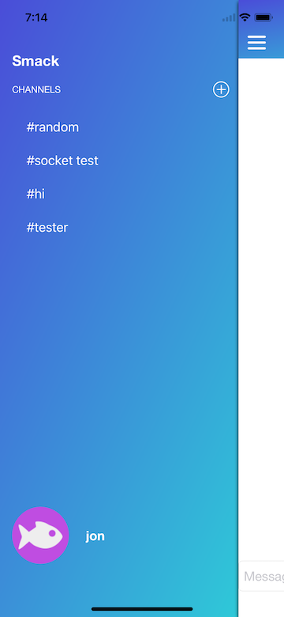

# What is Smack?

It is a little app i whipped up in xcode using swift 4, i was trying to build a slack clone, hence the name slcak :D

I really want to push it further and help entry level iOS developers get into open source development.

It works by using web socket and the back end is hosted on heroku. The back end is an API built by the devslopes team.

# Guide to the code

## 1. The Chat View Controller

This is the main view controller that opens up when you load up the app. The swift file for this view controller is in Smack/Controller/ChatVC.swift.

## 2. The Channel View Controller

This view controller is presented by pressing the hamburger icon at the top left or by sliding the screen from the left to the right. This presenting of this view controller is done by a library called SWReveal. The swift file for this is in Smack/Controller/ChanelVC.swift. It uses a custom ImageView for the user image which is located in Smack/Views/CircleImage.swift

## 3. The Login View Controller

It is presented by pressing the login button in the previous view controller. It's presented with the slide up animation and the code for this view controller is located in Smack/Controller/LoginVC.swift. It uses a custom UIButton that is located in Smack/Views/RoundedButton.swift

## 4. Create an account View controller

This view controller is presented by Clicking on the "don't have an account" button in the login view controller. Its swift file is in Smack/Controller/CreateAccountVC.swift. It uses the same custom UIButton as the Login view controller.

## 5. The Channel View Controller (Logged in)

This is the same as the normal channel view controller but it uses a table view to display the channels when the user is logged in. And it shows the username at the bottom.

## 6. The chat view controller (Logged in and selected a channel)

This is the same as the chat view controller but this is when the user has been logged in and also has selected a view controller. The chat messages are displayed using a table view.

## 7. The create-a-new-channel view Controller

This view Controller is presented by pressing the plus button on the channel view controller. The swift file for this view controller is located in Smack/Controller/AddChannelVC.swift and has its own xib file located in Smack/Xibs/AddChannelVC.xib. It uses a black background color with an alpha value of 0.4 to give it its transparency.

## 8. Profile View Controller

This view controller is very similar to the previous one, it's presented by pressing the user image icon on the channel view Controller. Its swift file is located in Smack/Controller/ProfileVC.swift and it also has its own xib file located in Smack/Xibs/ProfileVC.xib. It also uses a black background color with an alpha value of 0.4 to give it its transparency.
