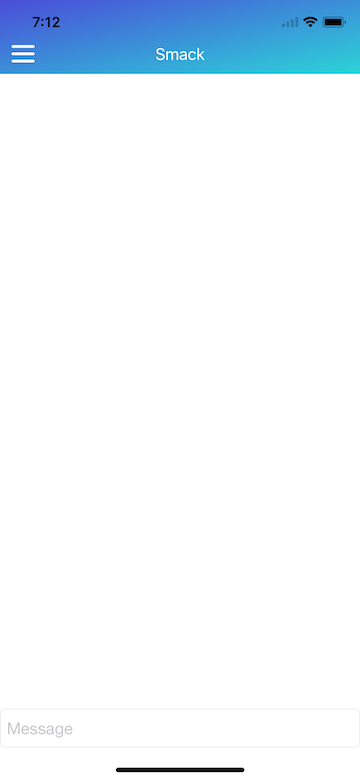

# What is Smack?

It is a little app i whipped up in xcode using swift 4, i was trying to build a slack clone, hence the name slcak :D

I really want to push it further and help entry level iOS developers get into open source development.

It works by using web socket and the back end is hosted on heroku. The back end is an API built by the devslopes team.

# Guide to the code

## 1. The Chat View Controller:

This is the main view controller that opens up when you load up the app. The swift file for this view controller is in Smack/Controller/ChatVC.swift.
